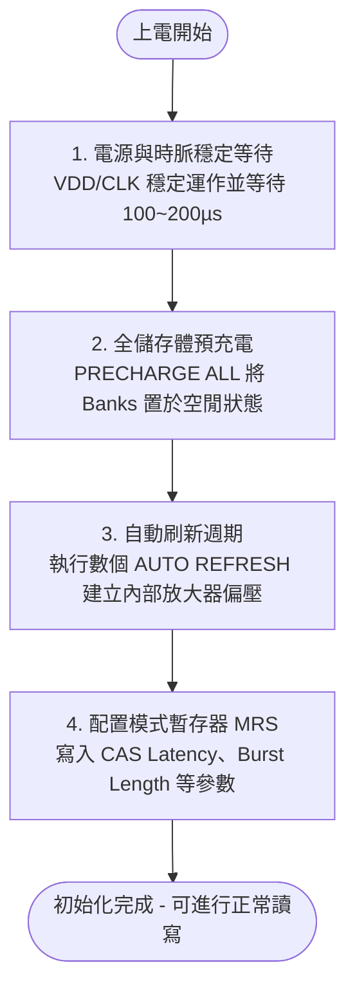

# C2000 EMIF 核心機制與硬體架構開發整合指南
> **說明**：本篇文件將 TI C2000 (F2837x / F2838x) 晶片在外部記憶體介面（EMIF）開發過程中，遺漏的六個核心設計與架構考量進行整合，脈絡化成一篇完整的開發指引。

---

## 導覽目錄
1. [EMIF 基礎定義與異質儲存體支援（含 FPGA 協同處理）](#1-emif-基礎定義與異質儲存體支援含-fpga-協同處理)
2. [系統實體空間映射（Memory Map）與 C28x PAB 22-bit 定址限制](#2-系統實體空間映射memory-map與-c28x-pab-22-bit-定址限制)
3. [非同步記憶體（SRAM / NOR Flash）配置與時序控制實務](#3-非同步記憶體sram--nor-flash-配置與時序控制實務)
4. [同步記憶體（SDRAM）上電與 MRS 模式暫存器初始化機制](#4-同步記憶體sdram-上電與-mrs-模式暫存器初始化機制)
5. [專案開發實務解密：1000 Steps 限制與 Datasheet 歸屬](#5-專案開發實務解密1000-steps-限制與-datasheet-歸屬)

---

## 1. EMIF 基礎定義與異質儲存體支援（含 FPGA 協同處理）

### 1.1 什麼是 EMIF？
**外部記憶體介面 (External Memory Interface, EMIF)** 是 C2000 MCU 上的高性能外部總線介面。它允許微控制器直接定址多種類型的外部異質儲存裝置，擴展了控制器的資料存取空間與資料吞吐頻寬。

### 1.2 原生支援的記憶體類型
EMIF 模組在硬體層面上提供了對多種儲存媒介的原生連線能力，主要分為兩大類：
* **非同步記憶體 (Asynchronous Memory)**：
  * **SRAM**：靜態隨機存取記憶體，通常用於高速資料快取或變數暫存。
  * **Flash ROM (NOR Flash)**：非易失性快閃記憶體，主要用於儲存啟動引導程式（Bootloader）、大型查找表（LUT）或離線參數。
* **同步記憶體 (Synchronous Memory)**：
  * **SDRAM**：同步動態隨機存取記憶體，提供極高的儲存容量（如 32MB），常用於波形暫存區、歷史 Log 資料庫等。

### 1.3 FPGA 協同處理器介接架構
在高性能嵌入式系統（例如多電平變頻器、主動電力濾波器 APF）中，EMIF 不僅僅用於擴展記憶體，更被廣泛應用為 **MCU 與 FPGA 之間的數據對接通道**。
* **角色定位**：FPGA 在此架構中扮演外部協同處理器、客製化硬體加速器或多通道高速通訊介面。
* **定址方式**：將 FPGA 的內部暫存器或雙埠 RAM（Dual-Port RAM）直接映射至 C2000 EMIF 的實體定址空間。MCU 讀寫該空間時，硬體會自動觸發外部總線波形，達到暫存器級別的低延遲資料交換。

---

## 2. 系統實體空間映射（Memory Map）與 C28x PAB 22-bit 定址限制

在規劃暫存器配置前，必須先理解 EMIF 的記憶體空間映射（Memory Map）及其底層硬體定址線的限制。

### 2.1 雙定址空間映射表
C2000 的 EMIF 提供兩個主要映射區間，均支援 CPU1/CPU2 及其各自的 DMA 自動傳輸：

| 映射空間名稱 | 起始與結束位址 (HEX) | 總實體容量 | 適用場景 |
| :--- | :--- | :--- | :--- |
| **Data 空間 (大映射區)** | `0x8000 0000` - `0x8FFF FFFF` | 256M x 16-bit | 大容量波形暫存區、歷史 Log 資料庫 |
| **Program + Data (小映射區)** | `0x0020 0000` - `0x002F FFFF` | 1M x 16-bit | 頻繁讀寫的控制參數、協同處理器暫存器 |

### 2.2 C28x 核心 PAB (程式位址匯流排) 22-bit 物理限制
C28x CPU 內部的 **程式位址匯流排 (Program Address Bus, PAB)** 受限於硬體架構，僅有 22-bit。這意味著：
* **定址極限**：PAB 僅能直接定址高達 `4M x 16-bit`（即 `0x003F FFFF` 以下的空間）。
* **物理瓶頸**：大定址區 `0x8000 0000` 遠高於 PAB 的定址上限。如果 CPU 直接執行讀寫該空間的 C 語言程式碼，編譯器將被迫退化至利用資料匯流排做低效的間接定址存取，這會造成極大的 CPU 週期浪費，嚴重影響控制演算法的即時性。

### 2.3 應對對策：DMA + 內部 GSx RAM 雙緩衝架構
為了解決上述物理限制，系統設計應採用 **資料流解耦架構**：
1. **背景搬移**：利用 DMA 在背景自動將外部 SDRAM（`0x8000 0000` 起始的大空間）與 MCU 內部的全域共享記憶體（GSx RAM，例如 `0x0000 D000`）進行大批量的資料搬運。
2. **CPU 高速運算**：CPU 僅存取無等待週期、且定址無限制的內部 GSx RAM。
3. **公式提示**：在規劃實體解碼位址與儲存單元關係時，應注意定址線的扣除關係，公式為：
   $$\text{位址空間} = \text{總容量} - \text{Bank 位元} - \text{Row 位元}$$

---

## 3. 非同步記憶體（SRAM / NOR Flash）配置與時序控制實務

當 EMIF 用於介接非同步記憶體（如外掛 SRAM 或 NOR Flash）時，通常會分配給片選腳位 `CS2n`、`CS3n` 或 `CS4n`。其時序控制暫存器必須精確配置以下三個核心時脈週期：

```
                    |<-- Setup -->|<------ Strobe ------>|<-- Hold -->|
EMIF_CSn  : ________|____________________________________|____________|________
                    |             |                      |            |
EMIF_OEn  : ______________________|______________________|_____________________
                    |             |                      |            |
EMIF_ADDR : ========X====================================X============X========
```

* **Setup 階段 (建立時間)**：位址與片選訊號（CS）拉起後，到讀寫致能訊號（OE/WE）拉起前的穩定等待時間，確保線路阻抗已完全穩定。
* **Strobe 階段 (脈衝時間)**：讀寫致能訊號保持有效的時間，這是外部記憶體晶片進行內部電容充電或驅動資料線的關鍵視窗。
* **Hold 階段 (保持時間)**：讀寫訊號結束後，位址與資料線必須繼續維持穩定的時間，確保資料已被 C2000 鎖存器或外部晶片正確寫入。

### 3.1 延伸等待機制 (Extended Wait) 與預防匯流排死鎖
如果外部非同步儲存裝置速度較慢（例如大容量 NOR Flash 的頁面寫入），或者外部 FPGA 需要動態調整數據就緒時間：
* **運作機制**：可以啟用 EMIF 的延伸等待機制，將 `EMxWAIT` 腳位與外部晶片的 Busy 訊號相連。當外部晶片拉低 `EMxWAIT` 時，EMIF 將會暫停 Strobe 階段的時脈計數，主動拉長訊號維持時間，直到等待訊號釋放。
* **死鎖保護**：為避免線路異常、硬體斷線或外部 FPGA 當機導致 `EMxWAIT` 永久保持在低電位，C2000 EMIF 暫存器中設有 **最大等待上限週期**。一旦超過此限制，硬體將強行中止該次傳輸並釋放外部總線，防止處理器因匯流排鎖死而全面崩潰。

---

## 4. 同步記憶體（SDRAM）上電與 MRS 模式暫存器初始化機制

與 SRAM 上電即可讀寫的特點不同，**SDRAM 內部是由動態電容矩陣組成**，在上電初期，其內部的狀態機是混亂且未定義的，**絕對無法直接進行讀寫**。處理器必須透過 EMIF 模組，依照規格書的要求發出嚴格的初始化指令序列。

### 4.1 SDRAM 上電初始化四大步驟



1. **電源與時脈穩定等待**：接通 VDD 且 CLK 開始震盪後，必須保持所有控制訊號為 NOP (No Operation)，等待晶片規格書要求的穩定時間（通常為 $100\ \mu\text{s}$ 至 $200\ \mu\text{s}$）。
2. **預充電 (PRECHARGE ALL)**：EMIF 控制器發出 PALL 命令，將所有內部的 Banks 預充電，關閉所有開啟的 Rows，使晶片回到完全空閒的狀態。
3. **自動刷新 (AUTO REFRESH)**：連續發出 2 到 8 次刷新命令，對晶片內部的電容矩陣進行充電刷新，確保內部感知放大器（Sense Amplifiers）完全穩定。
4. **配置模式暫存器 (Mode Register Set, MRS)**：透過位址線發送 MRS 指令，將工作參數寫入 SDRAM 內部的模式暫存器：
   * **CAS Latency (CL=2 或 3)**：行位址選通延遲，代表從發出讀取指令到資料出現在匯流排上的週期數。
   * **突發長度 (Burst Length)**：決定單次傳輸觸發的資料長度。
   * **突發類型 (Burst Type)**：決定定址的遞增方式。
   > **警告**：這些配置值必須與 EMIF 運作時脈（如 100MHz / 10ns 週期）進行嚴格的 AC 時序匹配計算，一旦配置錯誤，將導致嚴重的資料錯亂。

---

## 5. 專案開發實務解密：1000 Steps 限制與 Datasheet 歸屬

在實際控制系統專案（如伺服驅動器或 DDS 波形發生器）中，開發團隊經常就「1000 Steps (千步限額)」的規格產生架構理解分歧，以下進行澄清：

### Q1：為什麼 SDRAM 會受到 1000 Steps 的波形限制？
* **答案**：這是一個常見的理解誤區。**SDRAM 晶片本身沒有任何 1000 階的限制**。
* **物理事實**：專案選用的 IS42S16160J 是 32MB 的大容量晶片，若以 16-bit 格式存放波形，理論上可容納超過千萬點的資料。
* **規格成因**：**「1000 Steps」是韌體架構設計或產品階級定位（Product Tiering）的軟體定義限制**。
  * 例如：限制人機介面（HMI）一次更新的波形緩衝區大小。
  * 限制 DMA 在內部 RAM 分配的環形緩衝區（Ring Buffer）空間。
  * 產品商業分級銷售考量（高階產品開放 4096 Steps，低階產品限額 1000 Steps）。
  * **結論**：SDRAM 在此僅作為儲存該 1000 筆波形資料的「大倉庫」，而非硬體瓶頸。

### Q2：這個 "1000 Steps" 規格會記載於哪份 Datasheet？
* **答案**：此規格是產品級別的軟體定義，其文件歸屬如下：

| 文件名稱 | 是否會記載 "1000 Steps" 限制？ | 原因 |
| :--- | :---: | :--- |
| **SDRAM 晶片規格書**<br>*(例: IS42S16160J)* | **絕對不會** | 晶片商只負責定義記憶體物理讀寫時序與儲存容量（32MB），無法預知客戶如何分割軟體區段。 |
| **TI C2000 MCU 技術手冊**<br>*(例: F2837x / F2838x TRM)* | **絕對不會** | TI 僅定義 EMIF 週邊控制器的工作模式、極限頻率與定址線（256M words），不限制軟體框架設計。 |
| **最終產品規格書**<br>*(System Product Manual)* | **只會記載於此** | 這是您最終開發出的儀器或控制系統產品規格書。此限制是由您的產品系統分析師與韌體架構師所定義並載明的。 |

---
*文件編撰日期：2026-06-05*
